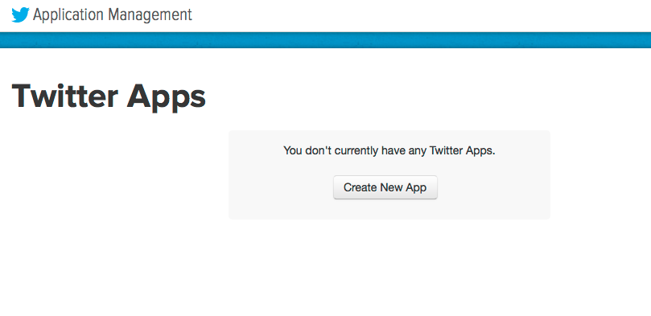
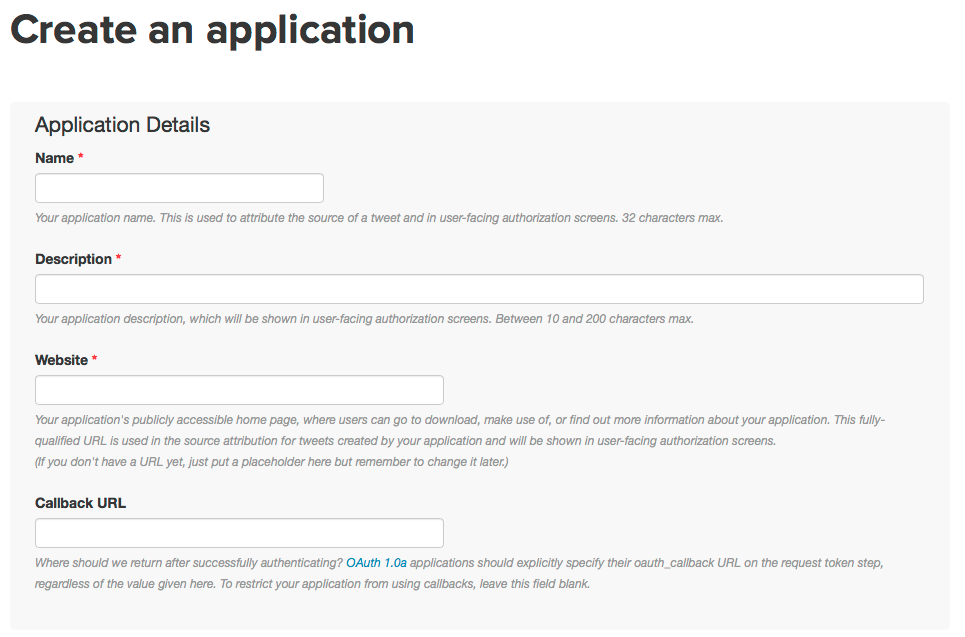
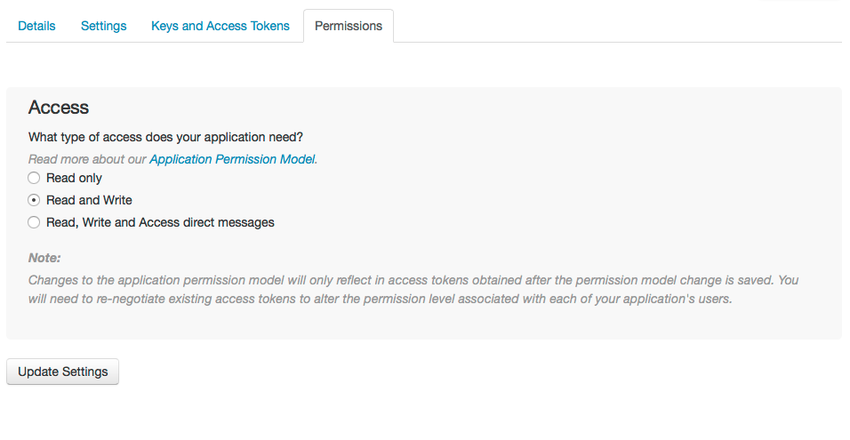

# tweets-collector
Collect tweets (tweets corpus) using Twitter API. 

Collection can be based on hashtags or keywords.

## install requirements 
```pip install -r requirements```
 
 
## Getting your API keys from Twitter
1. Go to [https://apps.twitter.com](https://apps.twitter.com) and create an new app


2. Provide a name and describe for the app, then specify permissions 


3. Then go to **keys and access management** tab 


4. put these info in [credentials.txt](twitter-files/credentials.txt) file.

## query_tweets.py Usage

```
usage: query_tweets.py [-h] -k KEYWORDS_FILE -o OUTFILE -n NUMBER

collect tweets based on keywords

optional arguments:
  -h, --help            show this help message and exit
  -k KEYWORDS_FILE, --keywords-file KEYWORDS_FILE
                        keywords or hashtags file. The file should contain one
                        keyword/hashtag per line
  -o OUTFILE, --outfile OUTFILE
                        the output json file path and prefix.
  -n NUMBER, --number NUMBER
                        the number of tweets that you want to collect


```


## json2text.py Usage
 
```
usage: json2text.py [-h] --json-file JSON_FILE -o OUTFILE

extract tweet texts from json

optional arguments:
  -h, --help            show this help message and exit
  --json-file JSON_FILE
                        tweets json file
  -o OUTFILE, --outfile OUTFILE
                        the output file.

```